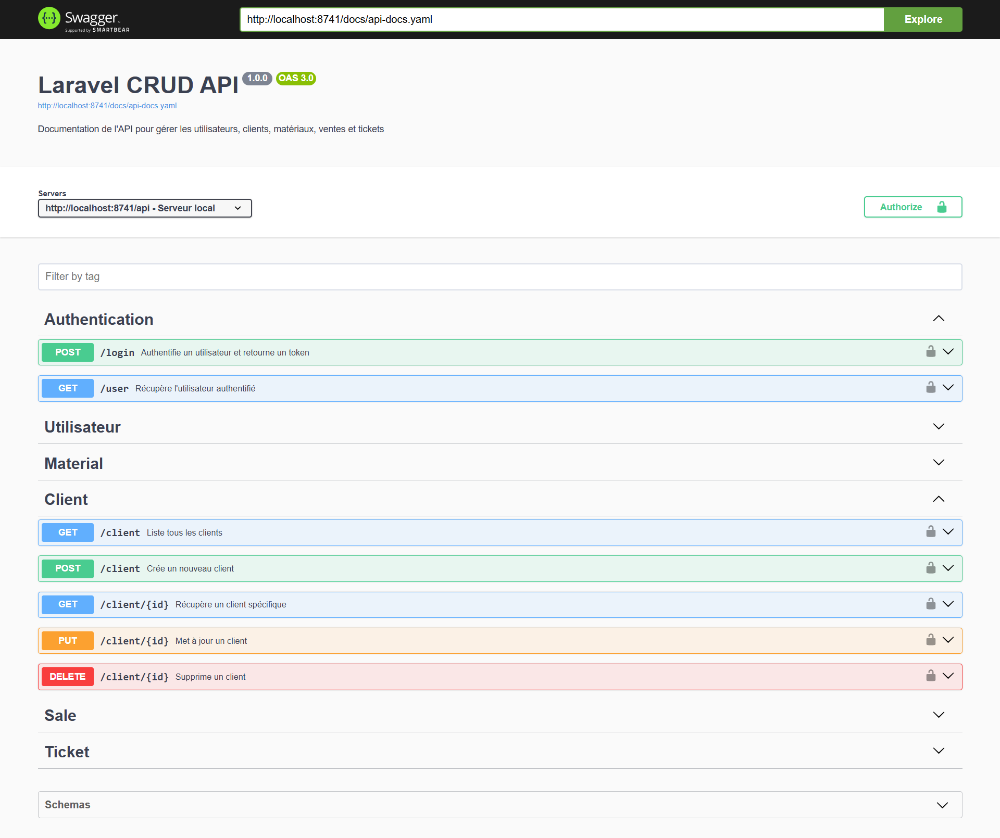
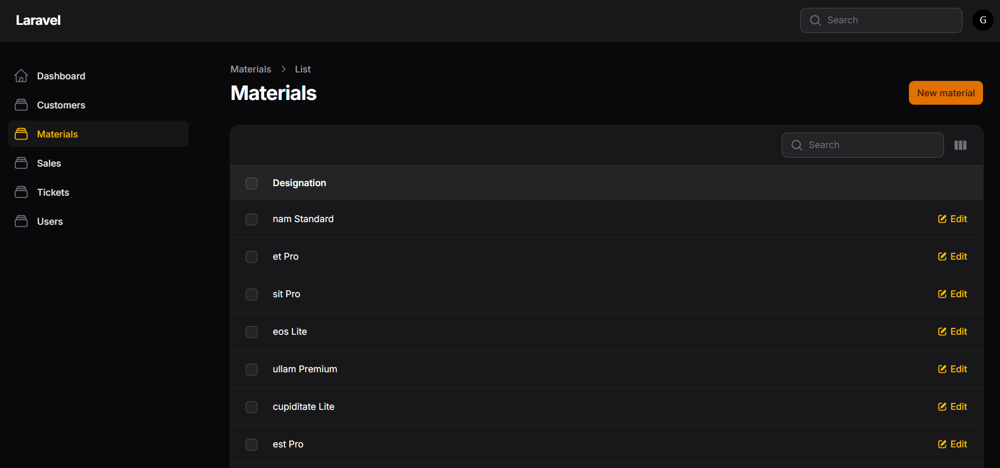
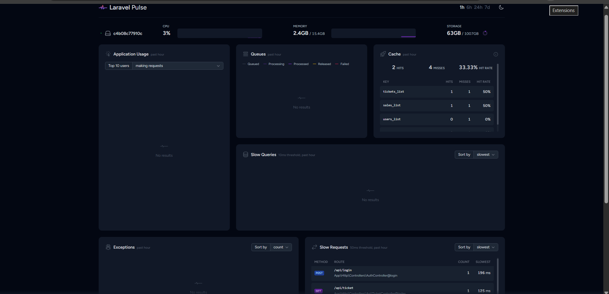

# 🚀 CRUD Docker Laravel 12 + React 19

Complete CRUD application with Laravel 12 API (JWT), React 19 front-end and MySQL under Docker.

## ✨ What's New in v2.0

- **Laravel 12** with JWT API (migrated from Laravel 10)
- **PHP 8.4** (upgraded from PHP 8.1)
- **React 19 (Standalone)**: Independent front-end application.
- **React 19 (Blade-integrated)**: Hybrid integration via **Vite** inside `app.blade.php`.
- **Pest**: Modern automated testing suite.
- **Swagger/OpenAPI**: Interactive API documentation.
- **MySQL 8.0**: Optimized database.
- **Complete Docker architecture**: Ready-to-use Apache/MySQL/Redis environment.
- **Filament v4**: Elegant administration panel (Modern alternative to Laravel Nova).
- **Redis Cache**: Performance optimization with automatic caching via **Observers**.
- **GitHub Actions CI/CD**: Automated pipeline testing both Backend (Pest) and Frontend (React) using MySQL & Redis services.
- **Laravel Octane (Swoole)** : High-performance server integration to keep the application in RAM, delivering near-instantaneous response times by bypassing disk I/O.
- **Laravel Pulse** : Real-time performance monitoring dashboard to track system health, slow queries, and cache usage at a glance.
- **CORS** : Optimized Cross-Origin Resource Sharing management for secure communication between Laravel backend and React frontend.

## 📋 Tech Stack

**Back-end:**
- Laravel 12 with REST API, Laravel Pulse/Octane/Filament/Cors
- PHP 8.4
- JWT Authentication
- Testing with Pest
- Swagger/OpenAPI Documentation
- Redis

**Front-end:**
- React 19
- JWT Authentication (login/register)

**Infrastructure:**
- Docker & Docker Compose
- Apache
- MySQL 8.0
- phpMyAdmin
- Redis

## 🔧 Prerequisites

- Docker
- Docker Compose

## 📦 Installation

1. **Clone and prepare the project:**
```bash
git clone https://github.com/ghyslain12/laravel-docker-apache-react.git
sudo chmod -R 777 laravel-docker-apache-react/
cd laravel-docker-apache-react
```

2. **Build and start containers:**
```bash
docker-compose up --build -d
```

3. **Install Laravel dependencies:**
```bash
docker exec -it laravel_app sh -c "composer install"
```

4. **Environment configuration:**
```bash
docker exec -it laravel_app sh -c "cp .env.example .env"
docker exec -it laravel_app sh -c "php artisan key:generate"
docker exec -it laravel_app sh -c "php artisan migrate"
```

## 🎮 Docker Usage

**Start services:**
```bash
docker-compose up
# or in detached mode
docker-compose up -d
```

**Stop services:**
```bash
docker-compose down
```

**View logs:**
```bash
docker-compose logs -f
```

## 🌐 Available Services

| Service            | URL                                     | Description                     |
|--------------------|-----------------------------------------|---------------------------------|
| **React**          | http://localhost:4200                   | User interface                  |
| **Laravel API**    | http://localhost:8741/api               | REST API                        |
| **Swagger**        | http://localhost:8741/api/documentation | Interactive API documentation   |
| **phpMyAdmin**     | http://localhost:8080                   | Database management             |
| **Redis**          | http://localhost:6379                   | High-performance caching server |
| **Filament Admin** | http://localhost:8741/admin             | Administration panel            |
| **Laravel Pulse**  | http://localhost:8741/pulse             | Pulse dashboard                 |

## 🔐 JWT Authentication

### Configuration

Enable/disable JWT in `.env` file:
```env
# Enable JWT
JWT_ENABLE=true

# Disable JWT
JWT_ENABLE=false
```

### Authentication Endpoints

 **`/api/login`** - Authentication and token generation

 **`/api/register`** - Register new user

 **`/api/logout`** - Logout and token invalidation

 **`/api/me`** - Get authenticated user

## 📡 API Endpoints

### Users

 **`/api/utilisateur`** - Create a user

 **`/api/utilisateur`** - List all users

 **`/api/utilisateur/{id}`** - Get a user

 **`/api/utilisateur/{id}`** - Update a user

 **`/api/utilisateur/{id}`** - Delete a user

### Other available resources
- Clients
- Materials
- Tickets
- Sales

> 📖 **Complete documentation**: [Swagger UI](http://localhost:8741/api/documentation)

## 🧪 Testing

Run tests with Pest:
```bash
docker exec -it laravel_app sh -c "php artisan test"
```

## 🛠️ Useful Commands

```bash
# Access Laravel container
docker exec -it laravel_app sh

# Run migrations
docker exec -it laravel_app sh -c "php artisan migrate"

# Create a controller
docker exec -it laravel_app sh -c "php artisan make:controller ControllerName"

# Clear cache
docker exec -it laravel_app sh -c "php artisan cache:clear"

# Generate Swagger documentation
docker exec -it laravel_app sh -c "php artisan l5-swagger:generate"
```

## 📸 Screenshots


*Main application interface*


*Login screen with JWT*


*Interactive API documentation*


*Successful authentication*


*Expired or invalid token*


*Administration panel*


*Pulse Dashboard*

## 🐛 Troubleshooting

**Permission issues:**
```bash
sudo chmod -R 777 project/storage project/bootstrap/cache
```

**Reinstall dependencies:**
```bash
docker exec -it laravel_app sh -c "composer install --no-cache"
```

**Rebuild containers:**
```bash
docker-compose down -v
docker-compose up --build -d
```

## 📝 Migration Notes (v1.0 → v2.0)

- **PHP 8.1 → 8.4**: Check package compatibility
- **Laravel 10 → 12**: New features and performance improvements
- **React 19**: Support for latest standalone components features
